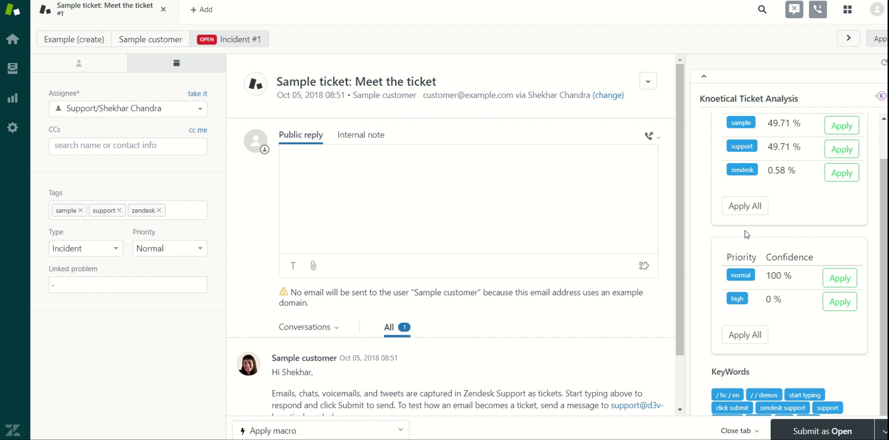
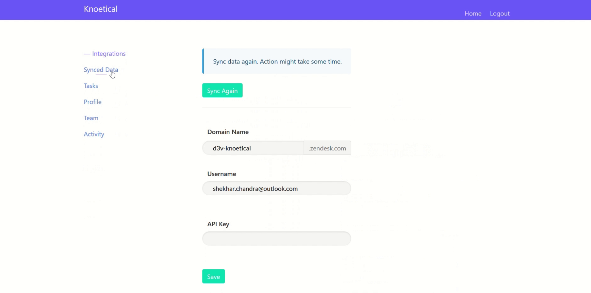
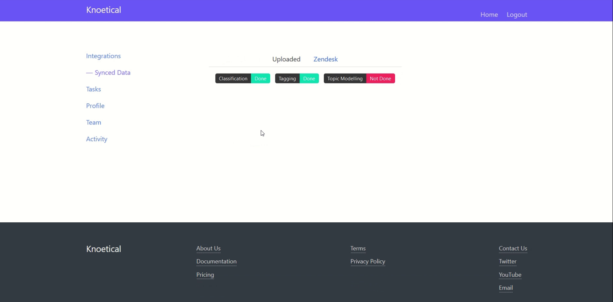

# Knoetical Ticket Analysis

Tag and classify tickets. Also get relevant tickets and suggestions for possible solution.

### Main Features

* Get real time suggestions for tagging and prioritize tickets. Suggestions come with confidence percentage as well to help agents pick the most relevant tag. The result is updated periodically to reflect the best suggestions at the moment.

* Get key phrases and words that are being mentioned in the conversation. This information helps agents to quickly identify the theme of the conversation. If there are relevant tickets in the archive then they will be shown as well.

Please submit bug reports to [GitHub](https://github.com/knoetical/zendesk-integration/issues). Pull requests are welcome.

### Screenshot(s):

